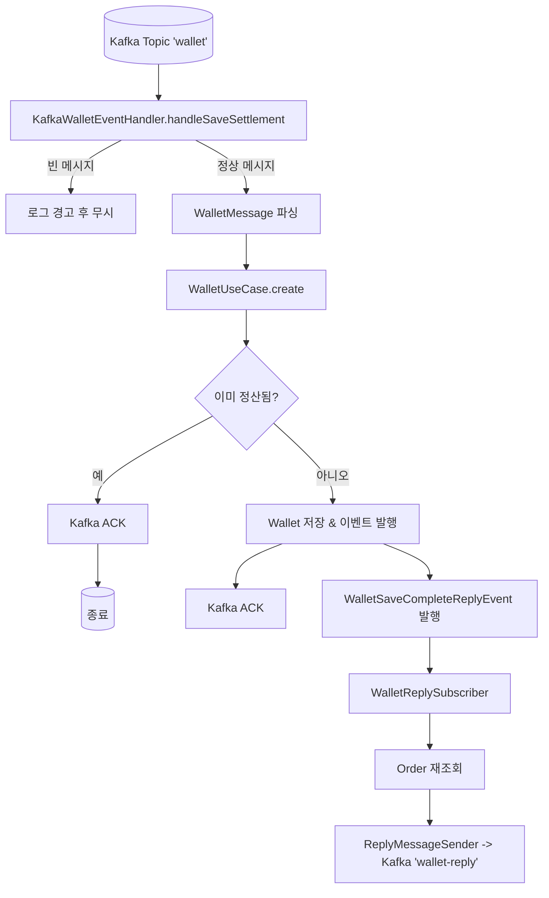
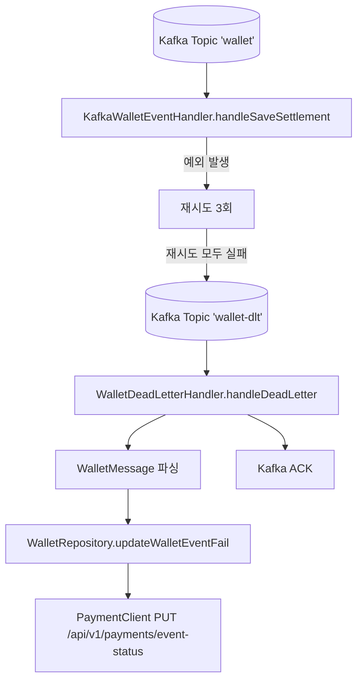

# Wallet Service

## Package structure
```
.
├── README.md
├── api
│   ├── build.gradle.kts
│   ├── gradle
│   │   └── wrapper
│   │       ├── gradle-wrapper.jar
│   │       └── gradle-wrapper.properties
│   ├── gradlew
│   ├── gradlew.bat
│   └── src
│       ├── main
│       │   ├── kotlin
│       │   │   └── me
│       │   │       └── golf
│       │   │           └── api
│       │   └── resources
│       │       ├── application.yml
├── app
│   ├── build.gradle.kts
│   ├── gradle
│   │   └── wrapper
│   │       ├── gradle-wrapper.jar
│   │       └── gradle-wrapper.properties
│   ├── gradlew
│   ├── gradlew.bat
│   └── src
│       ├── main
│       │   ├── kotlin
│       │   │   └── me
│       │   │       └── golf
│       │   │           ├── AppApplication.kt
│       │   │           └── app
│       │   └── resources
│       │       ├── application.properties
├── build.gradle.kts
├── core
│   ├── build.gradle.kts
│   ├── gradle
│   │   └── wrapper
│   │       ├── gradle-wrapper.jar
│   │       └── gradle-wrapper.properties
│   ├── gradlew
│   ├── gradlew.bat
│   └── src
│       ├── main
│       │   ├── kotlin
│       │   │   └── me
│       │   │       └── golf
│       │   │           └── core
│       │   └── resources
│       │       └── application.properties
│       └── test
│           └── kotlin
│               └── me
│                   └── golf
│                       └── core
├── gradle
│   └── wrapper
│       ├── gradle-wrapper.jar
│       └── gradle-wrapper.properties
├── gradlew
├── gradlew.bat
├── infra
│   ├── build.gradle.kts
│   ├── gradle
│   │   └── wrapper
│   │       ├── gradle-wrapper.jar
│   │       └── gradle-wrapper.properties
│   ├── gradlew
│   ├── gradlew.bat
│   ├── settings.gradle.kts
│   └── src
│       ├── main
│       │   ├── kotlin
│       │   │   └── me
│       │   │       └── golf
│       │   │           └── infra
│       │   └── resources
│       │       ├── application.properties
└── settings.gradle.kts
```

## 요구사항
- 정산 정보를 기록합니다.
- 정산 서비스는 사용자가 결제 완료 시 실제 판매자와 정산을 하기 위한 기록을 남기는 역할을 합니다.
- 정산 정보가 기록되면 정산 완료 이벤트를 Commerce Server로 보냅니다.
- 티켓팅 대상 공연 or 이벤트 날짜가 종료되고 정산을 시작한다고 가정합니다.
- 정산 정보 목록을 조회할 수 있어야 합니다.

| 필드명    | 설명                     |
| ------ | ---------------------- |
| 정산 ID  | 정산 식별자                 |
| 결제 금액  | 주문의 총 결제 금액            |
| 회사명    | 판매자 회사명                |
| 대표자 명  | 판매자 대표자명               |
| 수수료    | 플랫폼 수수료 금액             |
| 정산 상태  | REQUESTED, COMPLETED 등 |
| 정산 완료일 | 지급 완료일                 |
| 정산 생성일 | 정산 데이터 생성일             |

- 환불 시 정산 목록에서 제외되어야합니다.
- 정산 시 다음 정보를 저장합니다.

| 필드명     | 설명                     |
| ------- | ---------------------- |
| 주문 ID   | 주문 식별자                 |
| 총 결제 금액 | 구매된 총 금액               |
| 판매자 ID  | 정산 대상 판매자              |
| 수수료 정보  | 수수료 금액 및 정책            |
| 정산 상태   | REQUESTED, COMPLETED 등 |
| 정산 완료일  | 지급 완료일                 |
| 정산 생성일  | 정산 데이터 생성일             |


- 판매자 정보는 다음과 같습니다. (이하 판매자 생략)

| 필드명       | 설명                |
| --------- | ----------------- |
| 대표자 명     | 대표자 이름            |
| 회사명       | 판매자 상호명           |
| 사업자 등록 번호 | 판매자 사업자 번호        |
| 이메일       | 연락 이메일            |
| 휴대폰 번호    | 연락 휴대폰            |
| 입금 은행 명   | 정산 지급 은행          |
| 입금 계좌 번호  | 정산 지급 계좌 번호       |
| 예금주 명     | 예금주 이름            |
| 활성화 여부    | 판매자 상태 (ACTIVE 등) |
| 생성일       | 판매자 등록일           |
| 수정일       | 판매자 정보 수정일        |

## 목표
- Controller에 추상화 된 이벤트 리스너를 통해 Commerce Service로부터 이벤트를 수신합니다. 구현체는 인프라에 구현되어야 합니다.
- Commerce Service와는 다르게 도메인 모델을 JPA entity로 사용합니다.
- 정산에 대한 책임만 갖는다 결제 이벤트 추적관리는 오로지 Commerce Server에서 진행한다.

## 메시지 처리 흐름 (Message Consume → 처리)



- 소비: `wallet` 토픽에서 메시지 수신 → 공백은 스킵.
- 처리: JSON → `WalletMessage` 파싱 → `WalletUseCase.create` 실행.
- 중복 방지: 이미 정산된 주문이면 ACK 후 종료.
- 저장/후속 이벤트: Wallet 저장 → 트랜잭션 커밋 후 Reply 이벤트 발행 → Reply 메시지를 `wallet-reply` 토픽으로 송신.
- 커밋: 비즈니스 처리 성공 시 수동 ACK(`MANUAL_IMMEDIATE`).

## DLT 흐름 (실패/재시도/데드레터)



- 재시도: `@RetryableTopic`(시도 3회, 지수 백오프, `-retry`/`-dlt` 접미사).
- DLT 전송: 재시도 실패 시 `wallet-dlt`로 이동.
- DLT 처리: DLT 리스너가 파싱 후 결제 서버에 실패 상태 변경(HTTP PUT) 통지.
- 커밋: DLT 처리 후 수동 ACK.

참고 코드
- 컨슈머/ACK/에러핸들러: `infra/src/main/kotlin/me/golf/infra/config/KafkaConfig.kt`
- 재시도/DLT 설정: `infra/src/main/kotlin/me/golf/infra/config/KafkaRetryableWithDLT.kt`
- 정상 처리 리스너: `infra/src/main/kotlin/me/golf/infra/domain/wallet/handler/WalletEventHandler.kt`
- DLT 처리 리스너: `infra/src/main/kotlin/me/golf/infra/domain/wallet/handler/WalletDeadLetterHandler.kt`
- Reply 전송: `infra/src/main/kotlin/me/golf/infra/domain/wallet/sender/ReplyMessageSenderImpl.kt`
